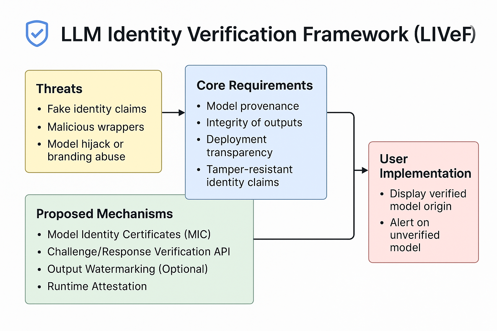

# 🔒 LLM Identity Verification Framework (LIVeF)

Language models like GPT-4, Claude, and DeepSeek are rapidly becoming critical infrastructure. But how do we **verify** we're talking to the real model—and not a malicious imposter?

## 🧩 Purpose

The LLM Identity Verification Framework (LIVeF) introduces mechanisms to ensure **model authenticity, integrity, and transparency**—just like HTTPS does for websites.



## 1. Introduction

Modern language models (LLMs) have become embedded in critical digital infrastructure, from customer service bots to medical advisors. However, a rising concern is the impersonation of trusted models—such as GPT-4, Claude, or DeepSeek—by unauthorized or malicious systems. This creates risks ranging from misinformation to brand damage and user manipulation.

**Goal**: Define a standardized, verifiable method to assert the true identity, origin, and integrity of a language model — similar to HTTPS for websites.

---

## 2. Threat Model

| Threat             | Description                                                                          |
| ------------------ | ------------------------------------------------------------------------------------ |
| Fake Identity      | A model falsely claims to be GPT-4, DeepSeek, etc.                                   |
| Malicious Wrappers | UI presents one model while using another behind the scenes.                         |
| Man-in-the-Middle  | Model output is altered before it reaches the user.                                  |
| Branding Hijack    | Third-party tools misrepresent model identity to steal credibility or mislead users. |

---

## 3. Trust Requirements

To ensure trust in model interactions, the following must be guaranteed:

* **Model Provenance**: Verifiable proof of where the model originated (e.g., OpenAI, DeepSeek).
* **Output Integrity**: Responses must not be tampered with during delivery.
* **Deployment Transparency**: Clear disclosure of which entity is hosting or wrapping the model.
* **Tamper-Resistant Identity Claims**: The model must not be able to lie about its origin or identity.

---

## 4. Proposed Solutions

### A. Model Identity Certificates (MIC)

A digitally signed certificate embedded in or attached to the model metadata:

```json
{
  "model_name": "deepseek-llm-33b",
  "provider": "deepseek.cn",
  "signature": "RSA-SHA256:abc123...",
  "issued_at": "2025-01-01",
  "expires": "2025-12-31"
}
```

* Validated by client SDK or platform wrapper.
* Ensures cryptographic binding between name and origin.

### B. Challenge/Response Verification API

* Clients issue an identity challenge prompt.
* Model returns a signed response that includes a digest or hash of its certificate.
* Useful for runtime verification.

### C. Output Watermarking (Optional)

* Embed an invisible watermark into token streams.
* Allows forensic tracing to identify model source in post hoc analysis.

### D. Runtime Attestation

* Use secure enclaves (e.g., Intel SGX) or zero-trust proof headers.
* Proves to users or verifiers that the model inference was unaltered and from the correct source.

---

## 5. User Interface Guidelines

* Always display the verified model name and provider:

  * Example: "Chatting with: **DeepSeek LLM-33B**, Verified by DeepSeek.cn"
* Include trust indicators:

  * Green checkmarks for validated models.
  * Warnings for unverifiable or spoofed models.

---

## 6. Governance and Standards

* A cross-org task force (e.g., OpenAI, Anthropic, DeepSeek, Meta, Hugging Face).
* Partner with standards bodies (ISO, IEEE, NIST).
* Encourage transparency in wrappers and open-source LLM tools.

Optional: Create a **Model Identity Consortium (MIC)** to maintain a public ledger of valid identity certificates and expose model fingerprints.

---

## 7. Conclusion

Impersonation and identity spoofing in AI is a new but serious threat. As language models play greater roles in public and private decision-making, ensuring trust in **who** users are talking to is as important as **what** is being said.

This framework proposes a flexible, layered approach to authenticating LLM identities—building a safer AI ecosystem for all users.


## 📣 Contribute

We welcome pull requests, suggestions, and discussions. Join the effort to make AI trustworthy!

